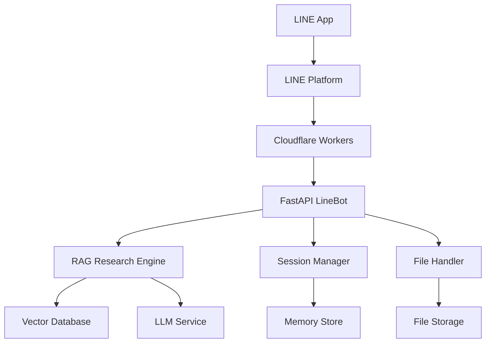

# Design Document

## Overview

本設計文件描述如何創建一個 FastAPI LineBot 機器人，整合現有的 RAG 研究助手系統。該機器人將提供 LINE 聊天介面，讓用戶能夠透過 LINE 平台使用 AI 研究助手功能，並部署到 Cloudflare Workers 上以獲得高可用性和低延遲。

系統將採用事件驅動架構，透過 LINE Webhook 接收用戶訊息，處理各種類型的請求（文字查詢、文件上傳、配置管理），並返回結構化的回應。

## Architecture

### 整體架構圖



### 核心組件

1. **FastAPI LineBot Server**: 主要的 Web 服務，處理 LINE Webhook 請求
2. **RAG Research Engine**: 整合現有的研究助手功能
3. **Session Manager**: 管理用戶會話和上下文
4. **File Handler**: 處理文件上傳和格式轉換
5. **Configuration Manager**: 管理用戶個人化設定

### 部署架構

- **Cloudflare Workers**: 作為無伺服器運行環境
- **Cloudflare KV**: 用於會話狀態和用戶配置存儲
- **Cloudflare R2**: 用於文件存儲（如果需要）

## Components and Interfaces

### 1. LineBot Handler

```python
class LineBotHandler:
    def __init__(self, channel_secret: str, channel_access_token: str)
    async def handle_webhook(self, request: Request) -> Response
    async def verify_signature(self, body: bytes, signature: str) -> bool
    async def process_event(self, event: Event) -> None
```

**職責:**
- 驗證 LINE Webhook 簽名
- 解析 LINE 事件
- 路由不同類型的事件到對應處理器

### 2. Message Router

```python
class MessageRouter:
    async def route_message(self, event: MessageEvent) -> None
    async def handle_text_message(self, event: MessageEvent) -> None
    async def handle_file_message(self, event: MessageEvent) -> None
    async def handle_postback(self, event: PostbackEvent) -> None
```

**職責:**
- 根據訊息類型路由到不同處理器
- 解析用戶指令和參數
- 管理對話流程

### 3. Research Service

```python
class ResearchService:
    def __init__(self, researcher_graph)
    async def process_research_query(self, user_id: str, query: str, config: dict) -> str
    async def get_research_status(self, user_id: str) -> dict
    async def cancel_research(self, user_id: str) -> bool
```

**職責:**
- 整合現有的 RAG 研究功能
- 管理長時間運行的研究任務
- 提供研究進度回饋

### 4. Session Manager

```python
class SessionManager:
    async def get_session(self, user_id: str) -> UserSession
    async def update_session(self, user_id: str, session: UserSession) -> None
    async def clear_session(self, user_id: str) -> None
    async def cleanup_expired_sessions(self) -> None
```

**職責:**
- 管理用戶會話狀態
- 保持對話上下文
- 清理過期會話

### 5. File Handler

```python
class FileHandler:
    async def download_file(self, message_id: str) -> bytes
    async def process_file(self, file_data: bytes, filename: str) -> bool
    async def validate_file(self, file_data: bytes, filename: str) -> bool
    def get_supported_formats(self) -> list[str]
```

**職責:**
- 下載 LINE 平台上的文件
- 驗證文件格式和大小
- 處理文件並加入向量資料庫

### 6. Configuration Service

```python
class ConfigurationService:
    async def get_user_config(self, user_id: str) -> UserConfig
    async def update_user_config(self, user_id: str, config: UserConfig) -> None
    async def reset_user_config(self, user_id: str) -> None
    def get_default_config(self) -> UserConfig
```

**職責:**
- 管理用戶個人化設定
- 提供配置選項介面
- 持久化用戶偏好

## Data Models

### UserSession

```python
@dataclass
class UserSession:
    user_id: str
    current_context: str
    research_history: list[ResearchQuery]
    last_activity: datetime
    config: UserConfig
    state: SessionState
```

### UserConfig

```python
@dataclass
class UserConfig:
    max_search_queries: int = 3
    enable_web_search: bool = False
    preferred_report_format: str = "standard"
    language: str = "zh-TW"
    notification_enabled: bool = True
```

### ResearchQuery

```python
@dataclass
class ResearchQuery:
    query_id: str
    user_query: str
    generated_queries: list[str]
    status: QueryStatus
    result: Optional[str]
    created_at: datetime
    completed_at: Optional[datetime]
```

### LINE Message Templates

```python
class MessageTemplates:
    @staticmethod
    def welcome_message() -> FlexMessage
    
    @staticmethod
    def help_message() -> FlexMessage
    
    @staticmethod
    def config_menu() -> FlexMessage
    
    @staticmethod
    def research_progress(progress: int) -> FlexMessage
    
    @staticmethod
    def research_result(result: str) -> list[Message]
```

## Error Handling

### 錯誤分類和處理策略

1. **LINE API 錯誤**
   - 簽名驗證失敗: 返回 401，記錄安全事件
   - 訊息格式錯誤: 返回 400，發送錯誤說明給用戶
   - API 限制: 實施重試機制和速率限制

2. **研究服務錯誤**
   - LLM 服務不可用: 發送服務暫時不可用訊息
   - 向量資料庫錯誤: 降級到僅使用網路搜尋
   - 查詢超時: 提供取消選項和狀態更新

3. **文件處理錯誤**
   - 不支援的格式: 發送支援格式清單
   - 文件過大: 提供檔案大小限制說明
   - 下載失敗: 請求用戶重新上傳

4. **會話管理錯誤**
   - 會話過期: 自動創建新會話
   - 存儲錯誤: 使用記憶體暫存，記錄錯誤

### 錯誤回應格式

```python
@dataclass
class ErrorResponse:
    error_code: str
    error_message: str
    user_message: str
    suggested_actions: list[str]
    retry_after: Optional[int] = None
```

## Testing Strategy

### 單元測試

1. **LineBot Handler 測試**
   - 簽名驗證功能
   - 事件解析和路由
   - 錯誤處理機制

2. **Research Service 測試**
   - RAG 功能整合
   - 異步任務處理
   - 配置參數影響

3. **Session Manager 測試**
   - 會話生命週期管理
   - 並發存取處理
   - 過期清理機制

4. **File Handler 測試**
   - 各種文件格式處理
   - 文件大小限制
   - 錯誤情況處理

### 整合測試

1. **LINE Webhook 整合**
   - 模擬 LINE 平台請求
   - 端到端訊息處理流程
   - 回應時間和格式驗證

2. **RAG 系統整合**
   - 研究查詢完整流程
   - 文件上傳到查詢流程
   - 配置變更影響測試

3. **Cloudflare Workers 部署測試**
   - 冷啟動性能測試
   - 環境變數配置測試
   - KV 存儲功能測試

### 效能測試

1. **負載測試**
   - 並發用戶處理能力
   - 長時間研究任務處理
   - 記憶體使用優化

2. **回應時間測試**
   - LINE Webhook 回應時間 (<10秒)
   - 文件處理時間
   - 研究查詢處理時間

### 安全測試

1. **認證和授權**
   - LINE 簽名驗證
   - 用戶身份驗證
   - 資料存取權限

2. **輸入驗證**
   - 惡意輸入防護
   - 文件內容安全檢查
   - SQL 注入防護（如適用）

## Cloudflare Workers 特殊考量

### 環境限制

1. **執行時間限制**: 最大 30 秒（付費版本為 15 分鐘）
2. **記憶體限制**: 128MB
3. **CPU 時間限制**: 50ms（付費版本為 30 秒）
4. **請求大小限制**: 100MB

### 優化策略

1. **異步處理**: 長時間研究任務使用 Durable Objects 或外部隊列
2. **快取策略**: 使用 Cloudflare KV 快取常用查詢結果
3. **資源管理**: 優化記憶體使用，避免大型物件常駐記憶體
4. **錯誤恢復**: 實施斷點續傳和狀態恢復機制

### 部署配置

```toml
# wrangler.toml
name = "linebot-rag-researcher"
main = "src/main.py"
compatibility_date = "2024-01-01"

[env.production]
kv_namespaces = [
  { binding = "SESSIONS", id = "session_store_id" },
  { binding = "CONFIGS", id = "config_store_id" }
]

[env.production.vars]
LINE_CHANNEL_SECRET = "your_channel_secret"
LINE_CHANNEL_ACCESS_TOKEN = "your_access_token"
OLLAMA_BASE_URL = "your_ollama_endpoint"
TAVILY_API_KEY = "your_tavily_key"
```